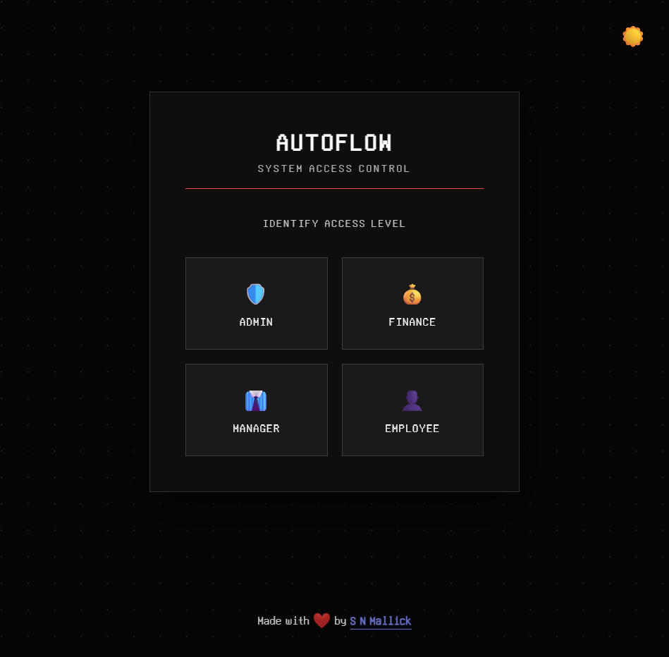
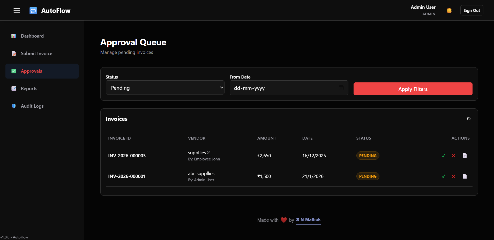
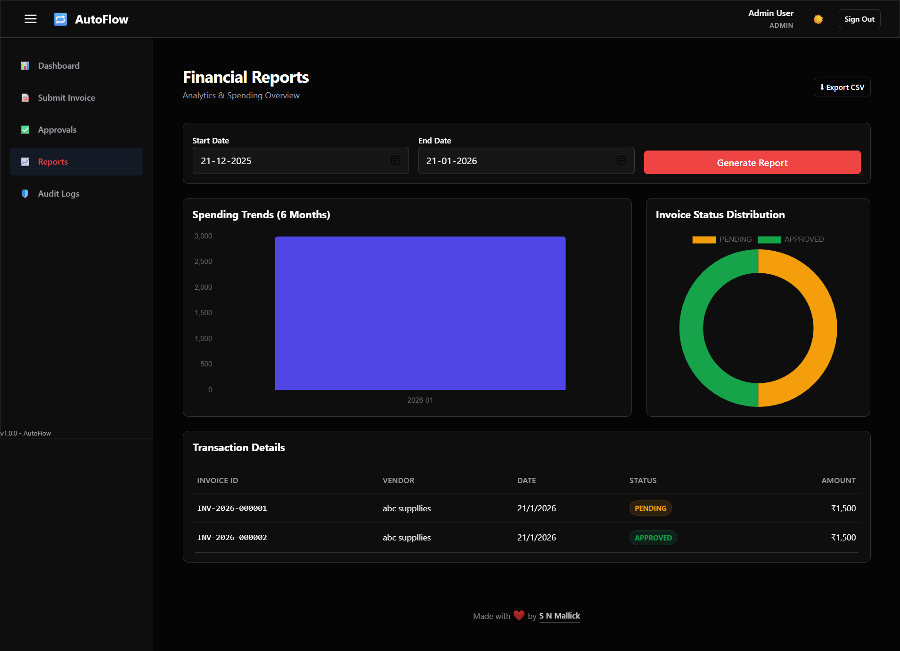

# AutoFlow — Enterprise Invoice Approval & Audit System

[](https://autoflow-vyvd.onrender.com)
[](https://github.com/snmallick2401/AutoFlow-Invoice-Approval-Audit-Workflow-System)
[](LICENSE)

**AutoFlow** is a secure, full-stack workflow automation platform designed to streamline financial operations. It features granular **Role-Based Access Control (RBAC)**, an **Immutable Audit Ledger** for compliance (SOC2 readiness), and real-time financial analytics.

> **🚀 Live Demo:** [https://autoflow-vyvd.onrender.com](https://autoflow-vyvd.onrender.com)  
> *Login credentials provided below.*

---

## 📸 Interface Preview

| **Secure Login & Role Identification** | **Executive Dashboard & KPIs** |
|:---:|:---:|
|  |  |
| **RBAC Approval Queue** | **Financial Analytics & Reporting** |
|  |  |

---

## 🌟 Key Features

### 🛡️ Security & Access Control
* **Multi-Tier RBAC:** Four distinct roles (**Admin, Finance, Manager, Employee**) with strictly enforced permission guards on both frontend and backend.
* **JWT Authentication:** Stateless, secure session management using JSON Web Tokens and `bcrypt` password hashing.
* **Smart Environment Detection:** Frontend architecture automatically adapts to `localhost` or Production environments without code changes.

### 📊 Compliance & Workflow
* **Immutable Audit Logs:** A tamper-proof, append-only ledger records every critical action (Login, Approval, Rejection) with IP tracking, ensuring data integrity for audits.
* **Approval State Machine:** Invoices move through a defined lifecycle (`Pending` → `Manager Approved` → `Finance Approved` or `Rejected`).
* **Real-Time Analytics:** Dynamic charting and KPI aggregation using MongoDB Aggregation Pipelines to visualize spending trends and status distributions.

---

## 🛠️ Technical Architecture

* **Backend:** Node.js, Express.js (RESTful API)
* **Database:** MongoDB Atlas, Mongoose ODM
* **Frontend:** Vanilla JavaScript (ES6+), HTML5, CSS3 (Custom Variables & Dark Mode)
* **Security Tools:** Helmet.js, CORS, Morgan (Logging)
* **Deployment:** Render Cloud Hosting (CI/CD connected to GitHub)

---

## 🧪 Live Demo Credentials

Test the Role-Based Access Control using these accounts on the [Live Site](https://autoflow-vyvd.onrender.com):

| Role | Email | Password | Capability Scope |
| :--- | :--- | :--- | :--- |
| **Admin** | `admin@autoflow.local` | `password123` | Full system access, Audit Log viewer |
| **Finance** | `finance@autoflow.local` | `password123` | Final approvals, Financial Reports |
| **Manager** | `manager@autoflow.local` | `password123` | First-level approvals |
| **Employee**| `john@autoflow.local` | `password123` | Submit invoices, View own history |

---

## 📂 Project Structure

```bash
AutoFlow/
├── src/
│   ├── controllers/      # Business logic (Auth, Invoices, Audits)
│   ├── middleware/       # JWT Auth & Role Guards
│   ├── models/           # Mongoose Schemas (User, Invoice, AuditLog)
│   ├── routes/           # API Endpoints
│   └── utils/            # Helper functions (Audit Logger)
├── public/               # Client-Side Code
│   ├── js/               # Application Logic (API wrapper, Charts)
│   ├── css/              # Styling (Themes, Components)
│   └── assets/           # Static Assets & Screenshots
├── uploads/              # Secure file storage for Invoices
└── server.js             # Entry Point
