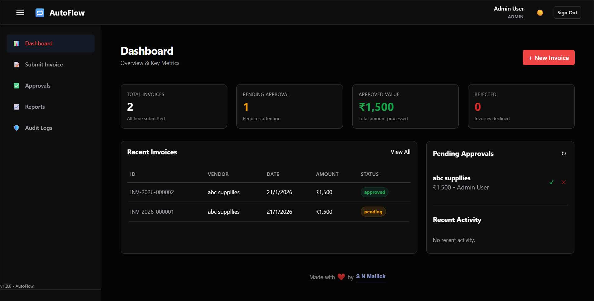

# AutoFlow — Invoice Approval & Audit Workflow System


> **Live Demo:** [https://autoflow-vyvd.onrender.com](https://autoflow-vyvd.onrender.com)  
> *Test credentials provided below.*

---

## 📖 Overview

**AutoFlow** is a secure, full-stack workflow automation platform designed to streamline financial operations for enterprises. It replaces manual invoice processing with a digital, role-based pipeline featuring granular access control, real-time analytics, and tamper-proof audit logging.

Built to demonstrate **SOC2-ready architecture**, it enforces strict data immutability for audit trails and uses a state-machine approach for invoice lifecycle management.

---

## 📸 Dashboard Preview



---

## 🚀 Key Features

### 🛡️ Enterprise Security & RBAC
* **Multi-Tier Access:** 4 distinct roles (**Admin, Finance, Manager, Employee**) with strict middleware guards ensuring users only access data relevant to their clearance level.
* **JWT Authentication:** Stateless, secure session management with Bcrypt password hashing.

### 🔒 Compliance & Auditing
* **Immutable Ledger:** Custom Mongoose middleware prevents any modification or deletion of `AuditLog` records, mimicking blockchain immutability for compliance.
* **Granular Tracking:** logs every action (Login, Approval, Rejection) with timestamps, actor IDs, and IP addresses.

### 📊 Real-Time Analytics
* **Aggregation Pipelines:** MongoDB aggregation is used to calculate live KPIs (Total Spend, Pending Actions, Rejection Rates) instantly.
* **Interactive Visuals:** Dynamic Chart.js integration for spending trends and status distribution.

### ⚡ Developer Experience
* **Smart Environment Detection:** The frontend automatically detects its environment (`localhost` vs. `production`), eliminating the need for manual API URL configuration.
* **Automated Seeding:** One-click database population script for rapid testing and deployment.

---

## 🛠️ Tech Stack

| Component | Technology | Key Usage |
| :--- | :--- | :--- |
| **Backend** | Node.js, Express.js | RESTful API, Middleware Guards |
| **Database** | MongoDB Atlas | Data Persistence, Aggregation |
| **ODM** | Mongoose | Schema Validation, Hooks |
| **Frontend** | Vanilla JS (ES6+) | DOM Manipulation, Fetch API |
| **Styling** | CSS3 (Variables) | Dark/Light Theme, Responsive Grid |
| **Deployment**| Render | Cloud Hosting, CI/CD |

---

## 🧪 Try It Out (Test Credentials)

Use these accounts to explore the different role-based views in the live demo:

| Role | Email | Password | Capability |
| :--- | :--- | :--- | :--- |
| **Admin** | `admin@autoflow.local` | `password123` | Full system access, Audit Logs |
| **Finance** | `finance@autoflow.local` | `password123` | Final approval, Financial Reports |
| **Manager** | `manager@autoflow.local` | `password123` | First-level approval |
| **Employee**| `john@autoflow.local` | `password123` | Submit invoices, View own history |

---

## ⚡ Local Installation

If you want to run this locally:

1.  **Clone the repo**
    ```bash
    git clone [https://github.com/snmallick2401/AutoFlow-Invoice-Approval-Audit-Workflow-System.git](https://github.com/snmallick2401/AutoFlow-Invoice-Approval-Audit-Workflow-System.git)
    cd AutoFlow-Invoice-Approval-Audit-Workflow-System
    ```

2.  **Install Dependencies**
    ```bash
    npm install
    ```

3.  **Configure Environment**
    Create a `.env` file in the root directory:
    ```env
    PORT=5000
    MONGO_URI=mongodb://localhost:27017/autoflow
    JWT_SECRET=your_secret_key
    ```

4.  **Seed Database**
    Initialize the database with the test users:
    ```bash
    node src/seed.js
    ```

5.  **Run Server**
    ```bash
    npm start
    ```
    Visit `http://localhost:5000` in your browser.

---

## 📂 Project Structure

```bash
AutoFlow/
├── public/             # Frontend (HTML/CSS/JS)
│   ├── js/api.js       # API Wrapper with Smart URL Detection
│   └── css/theme.css   # Theme variables
├── src/                # Backend Logic
│   ├── controllers/    # Request Handlers
│   ├── middleware/     # Auth & Role Guards
│   ├── models/         # Database Schemas (User, Invoice, AuditLog)
│   └── routes/         # API Endpoints
└── server.js           # Entry Point
